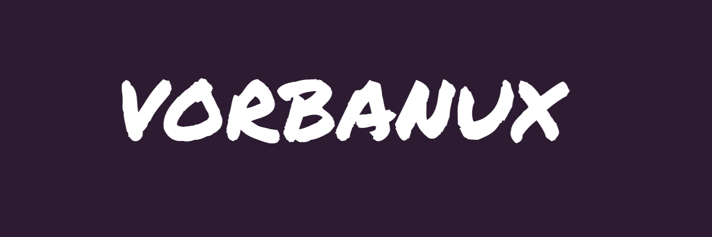

  
   
  <h1>Backend Engineer & Game Developer</h1>

  <table border="1" cellspacing="0" cellpadding="15" width="500" style="border-color: #3a3f47;">
    <tr>
      <td bgcolor="#171a21" align="left">
        <b>Steam</b>
          
        <!-- STEAM_STATUS:START -->
<table border="0" cellpadding="0" cellspacing="0" width="100%"><tr><td width="120" valign="top"></td><td valign="top"><b>130kmpeek(Vorbanux)</b>&nbsp;&nbsp;● в игре  АКТИВНОСТЬ: 🕹️ <b>Counter-Strike 2</b> (28.6 ч. за 2 недели)</td></tr></table>
<!-- STEAM_STATUS:END -->
      </td>
    </tr>
  </table>

    
  

   

<table width="100%" border="0" cellpadding="10" align="center">
  <tr>
    <td width="50%" bgcolor="#1f232a" valign="top">
      <h3>🚀  Языки Программирования</h3>
      <ul>
        <li><b>Python</b></li>
        <li><b>Lua</b></li>
        <li><b>C++</b></li>
        <li><b>JavaScript</b></li>
        <li><b>HTML5</b></li>
        <li><b>CSS3</b></li>
      </ul>
    </td>
    <td width="50%" bgcolor="#1f232a" valign="top">
      <h3>🎮 Game Development</h3>
      <ul>
        <li><b>Unreal Engine 5</b> (Blueprints, Python API)</li>
        <li><b>Lua Скриптинг</b> (Игровые системы)</li>
        <li>Roblox Studio / Интеграция API</li>
      </ul>
    </td>
  </tr>
</table>
